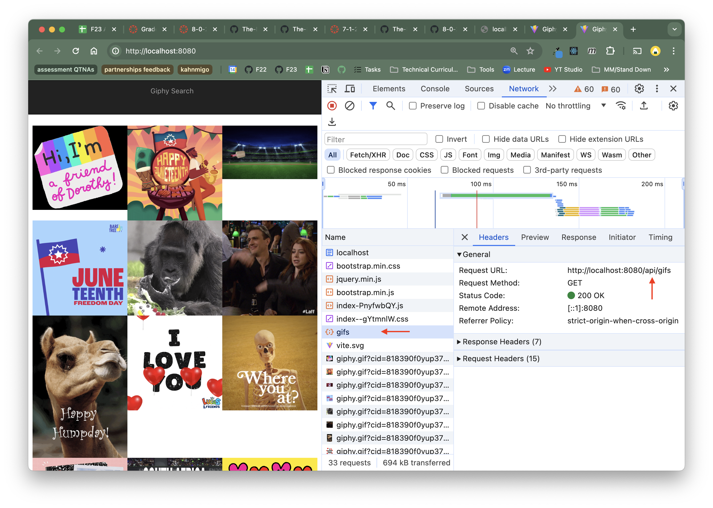

# 8-0-2-assignment

DEPLOYED LINK: [add your link here](addyourlinkhere)

In this assignment, you will use Express as a Middleman for API requests. Refer to the [lecture notes](https://github.com/The-Marcy-Lab-School/8-0-2-express-api-middleman) for support.

**Table of Contents**
- [Short Responses](#short-responses)
- [Grading](#grading)
- [Part 0 — Add your GIPHY API KEY](#part-0--add-your-giphy-api-key)
- [Part 1 — Create your Server](#part-1--create-your-server)
- [Part 2 — API Middleman](#part-2--api-middleman)
- [Part 3 — Deploy](#part-3--deploy)

## Short Responses

Do them first!!

## Grading

Your grade on this assignment will be determined by the number of tasks you are able to complete. Tasks appear as a checkbox, like this:

- [ ] example of an incomplete task
- [x] example of an completed task

Feel free to mark these tasks as complete/incomplete, however your instructor will likely modify your tasks when grading.

This assignment has 12 tasks and 1 bonus task:
- 4 setup tasks
- 7 server application tasks
- 1 deployment task

**Setup Technical Requirements**

Before continuing, make sure that these tasks are completed!

- [ ] Has a `server` folder with an `index.js` file and a `package.json` file inside
- [ ] `package.json` has `express` and `dotenv` installed as a dependency and `nodemon` as a dev dependency
- [ ] `package.json` has a `"dev"` script that uses `nodemon` and a `"start"` script that uses `node`
- [ ] Environment variables are stored in the `.env` folder and `.env` is added to the `.gitignore` file

**Server/Frontend Application Technical Requirements**

- [ ] In `index.js`, the `express()` function is used to create an `app`
- [ ] The `express.static()` middleware is used to server the static assets in the React application's `dist/` folder.
- [ ] The `app` listens on an available port (I recommend `8080`)
- [ ] A `/api/gifs` endpoint exists. 
- [ ] The `/api/gifs` endpoint sends a fetch request to the Giphy API using the API Key from `process.env` and sends a response (or an error) back to the client
- [ ] The frontend `vite.config.js` file has been updated to enable proxy requests
- [ ] The frontend sends a request to `/api/gifs` instead of directly to the Giphy API
- [ ] Bonus: The `/api/gifs` endpoint can parse the `req.query` parameters to get the search term and make a request to the Giphy API's search endpoint.

**Deployment Technical Requirements**

- [ ] Your server is deployed and the link is added to this repo's README

You got this!

## Part 0 — Add your GIPHY API KEY

We've given you a partially complete "Giphy Search" React project that uses the GIPHY API to fetch the top 25 trending gifs of the day. 

To get it to work, you'll need to log into your [GIPHY Developer Dashboard](https://developers.giphy.com/dashboard/) and copy your API Key into the `giphy-search/src/config.js` file (you'll need to make this file too).

Then, `cd` into the `giphy-search` folder, and run `npm i && npm run dev` to install dependencies and start the server. Confirm that the gifs are being fetched!

Finally, run `npm run build` to generate the `dist/` folder where your static assets will be served from.

## Part 1 — Create your Server

Now that we have a working "Giphy Search" React project, we need to fix an issue. We have "hidden" the API key in the `config.js` folder so that is not published on GitHub, but this presents two problems:
- We won't be able to deploy this project without the API key.
- If the API key is used by the client, then even if we were able to deploy the project with an API key, the user would be able to see (and steal) the API key by looking at the Developer Console Network tab and looking at the outgoing request.

In this project, we'll create a server to perform this fetch on behalf of the client. The client will send a request to the server for the gif data, the server will fetch that data using the API key and send the data to the client, and the client won't need to know the API key at all.

To get started, set up the `server` directory:

* Back in the root directory of this assignment, create a `server` folder. You should now have a `giphy-search` folder and a `server` folder in the root of your project.
* Inside the `server` folder, create an `index.js` file.
* Also in the `server` folder, create a `.env` file and store your Giphy API key inside

    ```
    API_KEY="paste-api-key-here"
    ```

* Create a `.gitignore` file with

    ```
    node_modules/
    .env
    ```

* `cd server` and run `npm init -y` to create a `package.json` file.
  * Run `npm i express dotenv` to install Express and the `dotenv` package
  * Run `npm i -D nodemon` to install Nodemon as a dev dependency
  * Modify the `package.json` file with the following `"scripts"`:

    ```json
    "scripts": {
      "dev": "nodemon index.js",
      "start": "node index.js"
    },
    ```

While working on your server, use `npm run dev` to run the server and have it restart whenever you make changes.

When deploying, you will use the `npm start` command to start the server using the normal `node` command.

## Part 2 — API Middleman

In `server/index.js`, create a simple Express server application. It should:
* Import environment variables from `.env` using `dotenv`
* Serve static assets from the `giphy-search/dist` folder
* Have an `/api/gifs` endpoint that can fetch from the Giphy API using your API key

Update the `giphy-search` React application:
* It should send requests to the `/api/gifs` endpoint of the server instead of the Giphy API.
* Run `npm run build` to update the `dist/` folder
* Update the `vite.config.js` file to enable proxy requests during development.

```js
import { defineConfig } from 'vite';
import react from '@vitejs/plugin-react';

const PORT = 8080;

// https://vitejs.dev/config/
export default defineConfig({
  plugins: [react()],
  server: {
    proxy: {
      '/api': {
        target: `http://localhost:${PORT}`,
        changeOrigin: true,
      },
    },
  },
});
```

Finally, confirm that you have successfully adjusted your frontend to use the server as a middleman for API requests by:
* `cd` back into your `server` folder
* Run the server with `npm run dev`
* Open the application
* Open the Developer Tools Network Tab and refresh the page
* You should see a request sent to `gifs` and there should NOT be a request sent to the Giphy API (see below)
  * If this is not the case, double check that you have re-built your frontend and updated the `dist/` folder.



**Bonus Challenge!**
Add a search endpoint to your server, letting the frontend send search GET requests to the backend using query parameters.
* When the user submits the search form with the term `"fox"`, the frontend should send a request to `/api/gifs?search=fox`.
* When the server receives this request, it should look at the `req.query` object to find the `search` value and then make a request to the Giphy API's search endpoint.

## Part 3 — Deploy

When you're done, push your code to github and [follow these steps to deploy using Render](https://github.com/The-Marcy-Lab-School/render-deployment-instructions). During the setup step, there will be a chance to add your API Key from Giphy as an environment variable.

Then, add the deployed link to your GitHub About section of the Giphy Search app. Click on the gear icon to set the Website url (see below)


